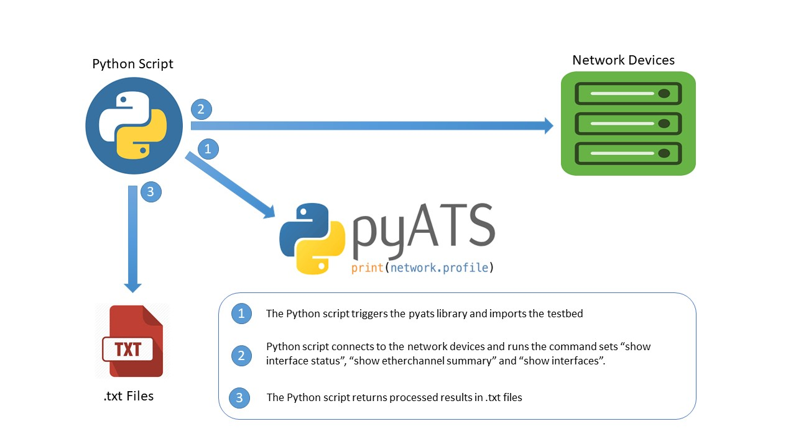

# Layer1_NetworkHealthCheck

Python Code that allows Network Engineers to run through their IOS,IOSXE and NXOS infrsatructure for layer 1 issues using pyats libraries.

## Overview

**Device/Interface Health**: 

The idea of the health check is to provide visibility into possible layer 1 problems within the network. The combination of the output CLI commands "show interface status" , "show etherchannel summary", and "show interfaces" would provide insights to interfaces not up and error counters on the interfaces. 

**Python**

The script is written in python using parsers from the genie library to convert cli output into structured data 

**Genie** 

**Output**: The results of the CLI commands are stored in simple .txt files: (L1_IOS.txt for IOS and IOSXE , and L1_NXOS for NXOS) 

## Contacts
*Oluyemi Oshunkoya (yemi_o@outlook.com)

## Solution Components
*Genie
*Python

## Prerequisites 

PYATS
Python3.6 and above

## Installation

1. Clone this repository into your desired directory using the command:

git clone https://github.com/yzmar4real/Layer1-Network-Health-Check.git

2. CD into the directory 

cd Layer1-Network-Health-Check 

3. Use the directory as a virtual environment for the project

python3 -m venv . 

4. Start the virtual environment and install the requirements for the project

source bin/activate

pip install pyats[library]
pip install genie 

5. Execute the main script from console

python Master.py

